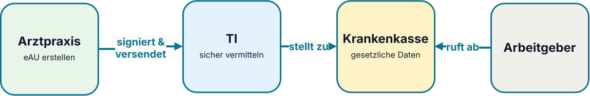

:PROPERTIES:
:ID:       vsm-de-telematikinfrastruktur
:END:
#+TITLE: Digitale Gesundheitsplattformen und APIs
#+SUBTITLE: Architekturansätze für skalierbare e-Health Vernetzung am Beispiel der Telematikinfrastruktur
#+AUTHOR: Dr. Fabian Franzelin
#+DATE: 2026-09-24
#+LANGUAGE: de
#+CATEGORY: Vorlesung
#+OPTIONS: toc:nil num:nil timestamp:nil author:t tags:nil ^:{}
#+EXCLUDE_TAGS: noexport
#+REVEAL_ROOT: ../assets/vendor/reveal.js
#+CONFIDENCE: Public — CC0-1.0
#+REVEAL_REVEAL_JS_VERSION: 4
#+REVEAL_THEME: white
#+REVEAL_MARGIN: 0.02
#+REVEAL_CENTER: nil
#+REVEAL_INIT_OPTIONS: center: false, margin: 0.02, transition: 'slide', width: 1200, height: 760, hash: true, history: true, hashOneBasedIndex: true
#+REVEAL_PLUGINS: (highlight RevealPointer)
#+REVEAL_TITLE_SLIDE: <h2>%t</h2><h4>%s</h4>
%a · %d

Probevortrag · W2-Professur Informatik · Hochschule Reutlingen

#+REVEAL_SLIDE_NUMBER: c/t
#+REVEAL_HLEVEL: 2
#+REVEAL_EXTERNAL_PLUGINS: (RevealPointer . "../assets/vendor/reveal.js-pointer/dist/pointer.js")
#+REVEAL_EXTRA_CSS: assets/vsm-theme.css
#+REVEAL_EXTRA_CSS: ../assets/vendor/reveal.js-pointer/dist/pointer.css
#+HTML_HEAD: <link href="../assets/vendor/fonts/fonts.css" rel="stylesheet">

* Willkommen zur Vorlesung

Schön, dass ich heute bei Ihnen sein darf.

#+HTML: 

#+HTML: 

#+ATTR_REVEAL: :frag (fade-in)
*Was ich heute mitbringe:*

#+ATTR_REVEAL: :frag (fade-in)
- Mich, einen *Softwarearchitekten*
- Einen *Leitfall* für die *Telematikinfrastruktur 2.0*
- Vier *Architekturprinzipien*
- Einen *Architekturansatz* zur *Skalierbarkeit* von e-Health Plattformen

#+HTML: 

#+HTML: 

#+ATTR_REVEAL: :frag (fade-in)
*Was Sie mitbringen:*

#+ATTR_REVEAL: :frag (fade-in)
- Sich, motivierte *Studierende*
- Info 1/2: *UML-Sequenzdiagramme*
- Medizininformatik: *Prozesse*
- *Neugier* auf: Cloud, Container, Zero Trust

#+HTML: 

#+HTML: 

#+begin_notes
- Kurze Vorstellung: Name, kurz woher (Bosch, Uni Stuttgart, TUM
  Medizininformatik), warum das Thema.
- Erwartungshaltung setzen: interaktiv, Fragen jederzeit willkommen.
- Brücke zum nächsten Slide: die Schlagzeile als Aufhänger.
#+end_notes

* Eine Nachricht, fünf Perspektiven

#+begin_quote
"Ein solches System konnte bisher noch nie gehackt werden."
/Karl Lauterbach/, 2024, Einführung der ePA
#+end_quote

#+ATTR_REVEAL: :frag (fade-in)
- *Als CCC:* Wie hacke ich das System? [fn:ccc]
- *Als Patient:* Sind meine Daten sicher?
- *Als gematik:* Wie reagiert man auf so einen Hack? \to TI 2.0
- *Als angehende Informatiker:* Wie baut man so etwas /richtig/?
- *Als Vortragender heute:* Zeigen wir das an einem Alltagsfall — der
  elektronischen Arbeitsunfähigkeitsbescheinigung (eAU).

#+begin_notes
Auf dem 38C3 (Dezember 2024) demonstrierten Bianca Kastl und Martin
Tschirsich (CCC), wie sich mit einer nachgemachten Institutionskarte
(SMC-B) Zugriff auf beliebige elektronische Patientenakten verschaffen
ließ. Der Titel des Talks — "Konnte bisher noch nie gehackt werden" —
ist ein Zitat des damaligen Gesundheitsministers. Der Hack traf einen
Nerv: Vertrauen war in TI 1.x an *Hardware und Netzsegment* gebunden,
nicht an *Identität und Kontext*. Genau das ist der Übergang zu Zero
Trust und TI 2.0, den wir heute anschauen.
#+end_notes

#+begin_footnotes
[fn:ccc] Martin Tschirsich, Bianca Kastl, "Konnte bisher noch nie
gehackt werden: Die elektronische Patientenakte kommt — jetzt für
alle!", 38C3, Chaos Computer Club, 27.12.2024. [[https://media.ccc.de/v/38c3-konnte-bisher-noch-nie-gehackt-werden-die-elektronische-patientenakte-kommt-jetzt-fr-alle][Link]]
#+end_footnotes

* Überblick

#+INCLUDE: "_outline-de.org::outline-0" :only-contents t

* Die elektronische Arbeitsunfähigkeitsbescheinigung

#+INCLUDE: "_outline-de.org::outline-1" :only-contents t

** Was ist die eAU? Ein verteilter Prozess

#+ATTR_HTML: :style display:block;margin:.25em auto;max-height:29vh;width:auto;

#+ATTR_REVEAL: :frag (fade-in)
- Praxissoftware erfasst und signiert die Bescheinigung.
- Die Krankenkasse erhält die für sie bestimmten Daten.[fn:gematik-eau]
- Der Arbeitgeber ruft die für ihn erforderlichen Daten ab.

#+ATTR_REVEAL: :frag (fade-in)
#+begin_quote
*Rollen? Prozesse? \to Sequenzdiagramme*
#+end_quote

#+begin_footnotes
[fn:gematik-eau] gematik, „Krankmeldung an Krankenkasse jetzt digital“, Pressemitteilung. [[https://www.gematik.de/newsroom/news-detail/pressemitteilung-krankmeldung-an-krankenkasse-jetzt-digital][Link]]
#+end_footnotes

#+name: eau-preamble
#+BEGIN_SRC plantuml :exports none
@startuml
autonumber
skinparam BoxPadding 10
skinparam ParticipantPadding 10
skinparam defaultFontSize 35
skinparam ActorFontSize 35
skinparam ParticipantFontSize 35
skinparam SequenceMessageFontSize 30
skinparam SequenceGroupFontSize 32
skinparam SequenceDividerFontSize 34
skinparam NoteFontSize 28
skinparam BoxFontSize 32
skinparam SequenceReferenceFontSize 30
#+END_SRC

#+name: eau-phase1
#+BEGIN_SRC plantuml :exports none
== Phase 1: Datenerhebung & Kassenmeldung ==

actor "Mitarbeiter (Bosch)" as MA
actor "Arztpraxis" as Arzt

box "Telematikinfrastruktur" #LightBlue
participant "Verzeichnisdienst\n(VZD)" as VZD
participant "KIM-Dienst (TI)" as TI
end box

box "Krankenversicherung" #LightGreen
participant "Krankenkasse\n(z.B. Techniker)" as KK
end box

MA -> Arzt: Untersuchung & \nFeststellung der AU
Arzt -> Arzt: eAU im Praxisverwaltungssystem\n(PVS) erstellen
Arzt -> VZD: KIM-Adresse der Kasse anfragen
VZD -> Arzt: KIM-Adresse zurückliefern
Arzt -> Arzt: eAU signieren
Arzt -> TI: eAU über KIM versenden
TI -> KK: eAU an die KIM-Adresse weiterleiten
#+END_SRC

#+name: eau-phase2
#+BEGIN_SRC plantuml :exports none
== Phase 2: Krankmeldung und eAU-Abruf ==

actor "Mitarbeiter (Bosch)" as MA

box "Krankenversicherung" #LightGreen
participant "Krankenkasse\n(z.B. Techniker)" as KK
end box

box "Bosch IT-Infrastruktur" #LightGray
participant "Bosch HR-System\n(Backend)" as HR
end box

MA -> HR: Übermittlung der Krankmeldungs-Metadaten
HR -> KK: Anfrage eAU (Name, Geburtsdatum, AU-Zeitraum)

alt eAU bereits bei Krankenkasse vorliegend
    KK -> HR: Rückmeldung eAU-Daten (Bestätigung & gesetzliche Daten)
    note over HR: Automatischer Abgleich der Zeiten\n& finale Freigabe der Fehlzeit.
else eAU noch nicht verarbeitet (Warteschleife)
    KK -> HR: Status: "Noch nicht verfügbar"
    note over HR: Erneuter automatischer Abruf\nnach X Stunden.
end
#+END_SRC

*** Phase 1: Datenerhebung & Kassenmeldung

#+BEGIN_SRC plantuml :file images/de-telematikinfrastruktur_eau_ablauf_p1.png :exports none :noweb yes
<<eau-preamble>>
<<eau-phase1>>
@enduml
#+END_SRC

#+ATTR_HTML: :style max-height:35vh;width:auto;
[[file:images/de-telematikinfrastruktur_eau_ablauf_p1.png]]

#+ATTR_REVEAL: :frag (fade-in)
- Identität vor Zugriff (Arzt)
- Heterogene Primärsysteme (PVS, VZD, KIM)
- Kommunikation über offene Netze

#+begin_notes
- *Identität vor Zugriff:* Der Arzt signiert die eAU mit seinem HBA — ohne
  überprüfbare Identität kein Versand
- *Heterogene Primärsysteme:* PVS, Verzeichnisdienst und KIM-Dienst stammen
  von unterschiedlichen Herstellern
- *Kommunikation über offene Netze:* Der Austausch findet über die TI hinweg zur Kasse
#+end_notes

*** Phase 2: Krankmeldung und eAU-Abruf

#+BEGIN_SRC plantuml :file images/de-telematikinfrastruktur_eau_ablauf_p2.png :exports none :noweb yes
<<eau-preamble>>
<<eau-phase2>>
@enduml
#+END_SRC

#+ATTR_HTML: :style max-height:35vh;width:auto;
[[file:images/de-telematikinfrastruktur_eau_ablauf_p2.png]]

#+ATTR_REVEAL: :frag (fade-in)
- Abruf an Person, Zeitraum und Zweck gebunden
- Asynchrone Übermittlung
- Mehrere Organisationen, eine Fachaufgabe

#+begin_notes
- *Versorgungskontext ist Teil der Berechtigung:* Der Abruf ist an Person,
  Zeitraum und Zweck gebunden, nicht an einen pauschalen Netzzugang.
- *Asynchrone Übermittlung:* Die eAU liegt bei der Kasse nicht garantiert
  sofort vor; das HR-System muss mit Warteschleife und Wiederholung umgehen.
- *Mehrere Organisationen, eine Fachaufgabe:* Praxis, TI, Krankenkasse und
  Arbeitgeber wirken zusammen, ohne einer gemeinsamen IT-Domäne anzugehören.
#+end_notes

** Von der Beobachtung zum Prinzip

#+HTML: 

#+HTML: 
#+HTML: 

#+ATTR_REVEAL: :frag (fade-in)
- /Beobachtung/ — Kommunikation über drei Organisationen

#+ATTR_REVEAL: :frag (fade-in)
- /Kernfrage/ — Wem darf ich bei *einer* Anfrage vertrauen?

#+ATTR_REVEAL: :frag (fade-in)
- /Prinzip/ — *Zero Trust*: Identität statt Netzgrenze

#+HTML: 

#+HTML: 

#+ATTR_REVEAL: :frag (fade-in)
- /Beobachtung/ — Asynchrone Übermittlung, Retry

#+ATTR_REVEAL: :frag (fade-in)
- /Kernfrage/ — Wie bleibt der Dienst verfügbar?

#+ATTR_REVEAL: :frag (fade-in)
- /Prinzip/ — *Hardware-Abstraktion & Cloud*: TI-Gateway zentral

#+HTML: 

#+HTML: 

#+ATTR_REVEAL: :frag (fade-in)
#+begin_quote
Diese zwei Prinzipien vertiefen wir jetzt.
#+end_quote

#+begin_notes
Beide Spalten folgen dem gleichen Dreischritt: Beobachtung aus
Phase 1–3 → Kernfrage → abgeleitetes Prinzip.

- *Zero Trust* (linke Spalte): Der eAU-Ablauf zeigt Daten, die
  Organisations- und Netzgrenzen überqueren. Ein Netzsegment allein
  trägt kein Vertrauen; Identität und Kontext (User, Gerät, Zweck)
  müssen bei *jeder* Anfrage geprüft werden — dazu durchgehende
  Verschlüsselung.
- *Hardware-Abstraktion & Cloud* (rechte Spalte): Asynchrone
  Übermittlung und Retry sind der Normalfall. Verfügbarkeit und
  rollende Updates lassen sich am besten über zentrale TI-Gateways
  erreichen, statt Hardware in jeder Praxis zu pflegen.

Falls Zeit bleibt, kurz erwähnen: digitale Identitäten
(Smartphone statt eHBA-Terminal) und offene Standards
(FHIR, OAuth/OIDC) als flankierende Prinzipien.
#+end_notes

* Architekturprinzipien der TI

#+INCLUDE: "_outline-de.org::outline-2" :only-contents t

** Prinzip 1: Zero Trust :ATTACH:
:PROPERTIES:
:ID:       b7a9fe71-badc-475e-bfa6-9d1f90850488
:END:

#+begin_quote
Zero Trust beschreibt ein aus dem "Assume Breach"-Ansatz entwickeltes
Architekturdesign-Paradigma, welches im Kern auf dem Prinzip der minimalen
Rechte aller Entitäten in der Gesamtinfrastruktur basiert.[fn:bsi-zero-trust]
#+end_quote

Das beinhaltet:

1. Jeder einzelne Zugriff muss authentifiziert werden
2. Jeder einzelne Zugriff muss verschlüsselt werden
3. Minimale Datenweitergabe \to *need-to-know* Prinzip
4. Die Berechtigungen sind kontextbezogen

#+begin_footnotes
[fn:bsi-zero-trust] Bundesamt für Sicherheit in der Informationstechnik (BSI),
„Zero Trust“. [[https://www.bsi.bund.de/dok/zero-trust][https://www.bsi.bund.de/dok/zero-trust]]
#+end_footnotes

#+begin_notes
Die entscheidende Sicherheitsfrage lautet nicht nur: /Ist die Verbindung
verschlüsselt?/ Sondern auch:

- Wer stellt eine eAU aus? (Arzt-Signatur mit HBA)
- Wer darf welche Information abrufen? (Kasse vs. Arbeitgeber)
- Welche Berechtigung gilt für genau diesen Zweck? (AU-Zeitraum, Person)
- Wie wird ein Zugriff nachvollziehbar? (Auditierbarkeit)
#+end_notes

** Prinzip 2: HW-Abstraktion & Cloud :ATTACH:
:PROPERTIES:
:ID:       8f488b39-7558-47d2-8894-b8cdf31f5f4d
:END:

#+begin_quote
Die Telematikinfrastruktur der Zukunft soll [...] den Konnektor durch
zentrale, cloudbasierte Zugangsdienste (TI-Gateway) ablösen und so
kurze Update- und Release-Zyklen ermöglichen.[fn:gematik-ti20]
#+end_quote

Das beinhaltet:

1. Zentraler Dienst statt Hardware pro Standort (*TI-Gateway*)
2. Rollende Auslieferung: Sicherheits-Patches in Stunden \to *CI/CD*
3. Elastische Kapazität als Nebeneffekt

#+begin_notes
- Kontrast: Konnektor-Zertifikatsablauf 2023 erzwang bundesweiten
  Hardware-Tausch in Praxen — politisch und wirtschaftlich ein
  Aufreger. In der Cloud wäre das ein rollendes Update gewesen.
- CI/CD kurz einführen: /Continuous Integration/Continuous Delivery/ —
  Code-Änderung wird automatisch getestet und ausgeliefert. Details
  folgen im TI-2.0-Deployment.
- Brücke: Wenn der Dienst zentral läuft, kann er nicht nur schneller
  aktualisiert, sondern auch elastisch skaliert werden — genau das
  schauen wir uns jetzt an.
#+end_notes

#+begin_footnotes
[fn:gematik-ti20] gematik, „Arena für digitale Medizin — Zielbild
Telematikinfrastruktur 2.0". [[https://www.gematik.de/telematikinfrastruktur/ti-20][Link]]
#+end_footnotes

* Verfügbarkeit & Skalierbarkeit

#+INCLUDE: "_outline-de.org::outline-3" :only-contents t

** Schauen wir uns die eAU wieder an... :ATTACH:
:PROPERTIES:
:ID:       6266ba15-03b4-49fd-aab0-dd169ba77486
:END:

#+ATTR_HTML: :width 60% :style display:block;margin-left:auto;margin-right:auto;
[[attachment:screenshot_20260921_230614.png]]

Im Mittel bei einem Zugriff pro eAU auf einen Arbeitstag (8h)[fn:ti-dashboard]
#+HTML: 

\begin{align*}
\frac{496\,\text{Mio.}\,\text{Fälle seit 01.08.2021}}{5.1\,\text{Jahre}} \approx 97\,\text{Mio. Fälle/Jahr} \approx 265\,\text{Tsd. Fälle/Tag} \approx 9 \,\text{Fälle/Sekunde}
\end{align*}
#+HTML: 

#+begin_footnotes
[fn:ti-dashboard] gematik TI-Dashboard, 21.09.2026, [[https://www.gematik.de/telematikinfrastruktur/ti-dashboard][Link]]
#+end_footnotes

** Schranken für die Auslegungslast

#+ATTR_REVEAL: :frag (fade-in)
- eAU: ca. 9 Zugriffe/Sekunde[fn:ti-dashboard]
- E-Rezept: ca. 152 Verordnungen/Sekunde[fn:ti-dashboard]
- elektronische Patientenakte: ca. 235 Zugriffe/Sekunde[fn:ti-dashboard]

#+ATTR_REVEAL: :frag (fade-in)
| Kennzahl                        | Wert [Zugriffe/s] | Herleitung                |
|---------------------------------+-------------------+---------------------------|
| Peak-Faktor Wochentag/Tageszeit | ×2                | Montag/Vormittag          |
| Peak-Faktor Infektwelle         | ×2–5              | Grippe-/COVID-Saison      |

#+ATTR_REVEAL: :frag (fade-in)
| Auslegungsbereich (ePA) | ~940–2.350 | Multiplikation Worst-Case |

#+ATTR_REVEAL: :frag (fade-in)
#+begin_quote
Die Architektur muss wesentlich mehr tragen als unser Leitfall.
#+end_quote

#+begin_footnotes
[fn:ti-dashboard] gematik TI-Dashboard, 21.09.2026, [[https://www.gematik.de/telematikinfrastruktur/ti-dashboard][Link]], gerechnet auf Sekunden wie auf Folie 12
#+end_footnotes

#+begin_notes
Bracket-Methode statt Punktwert: die untere Schranke motiviert die Grundkapazität,
die obere Schranke die Elastizität. Zwischen beiden liegt der Betrag, den man
durch Autoscaling einsparen kann — genau das rechtfertigt Cloud-Betrieb
gegenüber dediziertem Rechenzentrum.

| Anwendung | Volumen (Größenordnung)                          | Charakter                            |
|-----------+--------------------------------------------------+--------------------------------------|
| eAU       | ca. 97 Mio. Fälle/Jahr[fn:ti-dashboard]          | asynchron, wenige Transaktionen/Fall |
| E-Rezept  | ca. 1144 Mio. Verordnungen/Jahr[fn:ti-dashboard] | synchron, Spitzen in Apotheken       |
| ePA       | ca. 1768 Mio. Zugriffe/Jahr[fn:ti-dashboard]     | häufige, feingranulare Zugriffe      |

Gerechnet auf 261 Werktage ohne Samstage im Jahr

Vergleich mit realen Systemen

- Typischer Unternehmens-Web-Service: 10–500 req/s
- Große SaaS-API (mittlere Last): 1.000–5.000 req/s
- Twitter/X-Timeline (Peak): ~300.000 req/s (global, verteilt)
- Google Search: ~100.000 req/s (global)
- Stack Overflow (gesamt): ~5.000 req/s
#+end_notes

** TI-2.0-Deployment: eAU

#+name: ti2-overview
#+BEGIN_SRC plantuml :file images/de-telematikinfrastruktur_ti2_overview.png :exports results
@startuml
left to right direction
skinparam componentStyle uml2
skinparam shadowing false
skinparam defaultFontName "Helvetica"
skinparam nodesep 14
skinparam ranksep 26
skinparam node {
  BackgroundColor #FDFDFD
  BorderColor #666666
}
skinparam component {
  BackgroundColor #F5F7FA
  BorderColor #4A6FA5
}
skinparam database {
  BackgroundColor #EEF4FB
  BorderColor #4A6FA5
}

' ============ Arztpraxis (dezentral) ============
node "Arztpraxis" as P <<Standort>> #E8F5E9 {
  component "PVS-Workstation" as WS
  component "VPN-Client" as VPN
}

' ============ Provider-Cloud (TI-Gateway + KIM-Anbieter, gematik-zertifiziert) ============
node "Provider-Cloud (gematik-zertifiziert)" as CLOUD <<souveräne DE-Cloud>> #E3F2FD {
  component "TI-Gateway\n(Konnektor-Ersatz)" as GW
  component "KIM-Fachdienst\n(Anbieter)" as KIM
  database  "VZD\n(Verzeichnisdienst)" as VZD
  artifact  "SM-B\n(HSM-basierte\nInstitutionsidentität)" as SMB
}

node "Empfänger" as EMP #FFF8E1 {
  component "GKV / weitere LE" as GKV
}

' ============ Kanten ============
WS  --> VPN
VPN ==> GW    : mTLS
GW  ..> SMB   : Auth / Signatur
KIM ..> SMB   : S/MIME-Krypto
GW  --> KIM   : S/MIME o. SMTP
KIM ..> VZD   : Lookup
KIM --> GKV   : Zustellung

@enduml
#+END_SRC

#+ATTR_HTML: :style max-height:30vh;width:auto;
#+RESULTS: ti2-overview
[[file:images/de-telematikinfrastruktur_ti2_overview.png]]

#+ATTR_REVEAL: :frag (fade-in)
- *Elastisch:* mehr TI-Gateways, weniger bei Ruhe \to *K8s Pods*
- *Entkoppelt:* KIM-Zustellung über Briefkasten \to *Message Queues*
- *Aktuell:* Updates fließen automatisch ein \to *CI/CD*
- *Offene Frage:* technisch machbar — aber /zertifizierbar/?

#+begin_notes
*Kurz-Glossar (rechts oben im Bild):*

| Begriff       | Kurz gesagt                                                         |
|---------------+---------------------------------------------------------------------|
| Container/Pod | Verpackte Anwendung, startet in Sekunden — bei Bedarf hundertfach   |
| mTLS          | Verschlüsselte Verbindung, bei der /beide Seiten/ Ausweis vorzeigen   |
| Ingress       | "Empfangstresen" der Cloud: verteilt Anfragen auf freie Pods        |
| Message Queue | Briefkasten zwischen Diensten — entkoppelt Sender und Empfänger     |
| CI/CD         | Automatisierte Pipeline: Code \to Test \to Auslieferung ohne Handarbeit |
#+end_notes

#+begin_notes
Die Studierenden kennen aus Info 2 HTTP und JSON — Container, Pods,
mTLS, Ingress und Message Queues sind neu. Deshalb bewusst zuerst das
Glossar, dann die vier Konsequenzen. Die letzte Frage ("zertifizierbar?")
ist die Brücke zur Zusammenfassung: TI 2.0 wird derzeit ausgerollt, weil
gematik genau diese Zertifizierungswege geöffnet hat.
#+end_notes

* Zusammenfassung & Ausblick

#+INCLUDE: "_outline-de.org::outline-4" :only-contents t

** Zusammenfassung

1. *Digitale Gesundheitsplattform*: Viele Rollen, eine Fachaufgabe

2. *APIs & offene Standards*: Vernetzung wird dienstorientiert

3. *Skalierbarkeit*: Von 9 Zugriffen/s (eAU-Mittel) bis ~2.350/s (Peak,
   ePA-Klasse) — elastisch durch Cloud.

4. *Telematikinfrastruktur 2.0*: Zero Trust statt Netz-Perimeter —
   Vertrauen an Identität und Kontext gebunden

#+ATTR_REVEAL: :frag (fade-in)
#+begin_quote
"Ein solches System konnte bisher noch nie gehackt werden."
/Zukünftiges Ich/
#+end_quote

