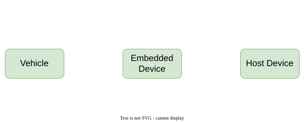
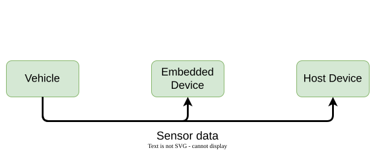
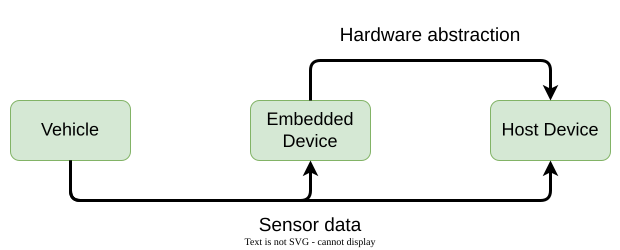
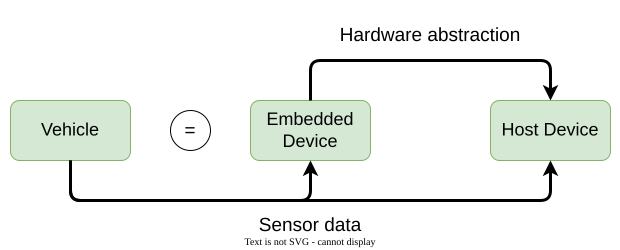
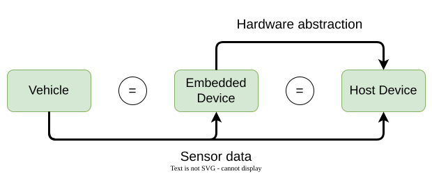
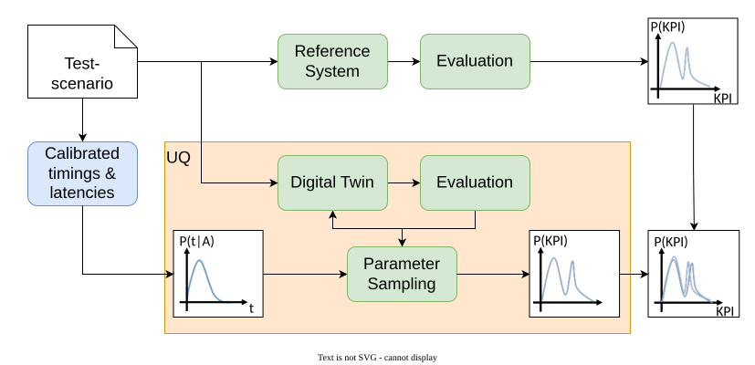

:PROPERTIES:
:ID:       vsm-en-digital-twins
:END:
#+TITLE: Digital Twins
#+SUBTITLE: Credible virtual models across domains
#+AUTHOR: Dr. Fabian Franzelin
#+DATE: 2026-09-24
#+LANGUAGE: en
#+CATEGORY: Talk
#+OPTIONS: toc:nil num:nil timestamp:nil author:t tags:nil ^:{}
#+EXCLUDE_TAGS: noexport
#+REVEAL_ROOT: ../assets/vendor/reveal.js
#+CONFIDENCE: Public — CC0-1.0
#+REVEAL_REVEAL_JS_VERSION: 4
#+REVEAL_THEME: white
#+REVEAL_MARGIN: 0.02
#+REVEAL_CENTER: nil
#+REVEAL_INIT_OPTIONS: center: false, margin: 0.02, transition: 'slide', width: 1200, height: 760, hash: true, history: true, hashOneBasedIndex: true
#+REVEAL_PLUGINS: (highlight RevealPointer)
#+REVEAL_TITLE_SLIDE: <h2>%t</h2><h4>%s</h4>
%a · %d

Talk · W2-Professorship Computer Science · Reutlingen University

#+REVEAL_SLIDE_NUMBER: c/t
#+REVEAL_HLEVEL: 2
#+REVEAL_EXTERNAL_PLUGINS: (RevealPointer . "../assets/vendor/reveal.js-pointer/dist/pointer.js")
#+REVEAL_EXTRA_CSS: assets/vsm-theme.css
#+REVEAL_EXTRA_CSS: ../assets/vendor/reveal.js-pointer/dist/pointer.css
#+HTML_HEAD: <link href="../assets/vendor/fonts/fonts.css" rel="stylesheet">

* Introduction :ATTACH:
:PROPERTIES:
:ID:       5945ce65-f992-4eb4-801c-5266100b71ff
:END:

#+begin_quote
*Reliable* testing of the application code of a *release* candidate of a
robotaxi platform at high scale, with *13,500 h* of recomputed data
within *7 days*.​
#+end_quote

#+HTML: 

#+HTML: 

1. Applications are exposed to *uncontrollable uncertainties*
2. The digital twin is a *reliable, virtual model* of the vehicle
3. Use *Uncertainty Quantification (UQ)* to close the reality gap
4. Run representative test scenarios on the digital twin *at scale* in
   the cloud

#+HTML: 

#+HTML: 

#+ATTR_HTML: :alt Daimler-Bosch robo taxi :style width:100%; height:auto; display:block; margin:0 auto; border-radius:0.3em;
[[attachment:daimler-bosch-robotaxi-560x600.jpg]]

#+HTML: 

#+HTML: 

* The Setup

#+HTML: 

#+HTML: 

#+ATTR_HTML: :alt Vehicle, embedded device, and host device :style position:absolute; inset:0; width:100%; height:100%; object-fit:contain;

#+ATTR_HTML: :class fragment fade-in-then-out :data-fragment-index 1 :alt Sensor data flows from the vehicle to embedded and host devices :style position:absolute; inset:0; width:100%; height:100%; object-fit:contain;

#+ATTR_HTML: :class fragment fade-in-then-out :data-fragment-index 2 :alt Hardware abstraction connects the embedded and host devices :style position:absolute; inset:0; width:100%; height:100%; object-fit:contain;

#+ATTR_HTML: :class fragment fade-in-then-out :data-fragment-index 3 :alt First equality relationship in the setup :style position:absolute; inset:0; width:100%; height:100%; object-fit:contain;

#+ATTR_HTML: :class fragment fade-in :data-fragment-index 4 :alt Complete vehicle digital twin setup :style position:absolute; inset:0; width:100%; height:100%; object-fit:contain;

#+HTML: 

#+ATTR_HTML: :class fragment fade-in :data-fragment-index 3
Behavior on the *embedded device* *matches* the vehicle.

#+ATTR_HTML: :class fragment fade-in :data-fragment-index 4
Behavior on the *host device* *matches* the vehicle.

* Credibility Through Co-Simulation

#+HTML: 

#+HTML: 
#+HTML: 

*Middleware Player*

- Controls *data flow* between applications
- Controls *control flow* of applications

*Timing Simulation*

- Receives workload information
- Captures timing behavior
- Provides schedule updates

#+HTML: 

#+HTML: 

#+ATTR_HTML: :alt Middleware between vehicle and digital twin :style width:100%; max-width:420px; height:auto; display:block; margin:0 auto;
[[file:images/en-digital-twin-co-simulation.png]]

#+HTML: 

#+HTML: 

* Verification via UQ

#+HTML: 

#+ATTR_HTML: :alt Uncertainty quantification for the digital twin :style position:absolute; inset:0; width:100%; height:100%; object-fit:contain;

#+HTML: 

#+HTML: 

UQ closes the reality gap → evidence for the *credibility assessment*
#+HTML: 

#+HTML: 

* Conclusion - Cars to Clinics

#+HTML: 

#+HTML: 
#+HTML: 

*Networked Systems*

- Service oriented communication — from ECUs to SDC/BICEPS medical devices

*Co-simulation & Middleware*

- Middleware player → patient-specific device twin

*Credibility Assessment*

- Aligns with regulatory needs (ISO 26262 → IEC 62304)

#+HTML: 

#+HTML: 

#+ATTR_HTML: :alt Middleware between vehicle and digital twin :style width:100%; max-width:420px; height:auto; display:block; margin:0 auto;
[[file:images/en-digital-twin-co-simulation.png]]

#+HTML: 

#+HTML: 

* References
:PROPERTIES:
:reveal_extra_attr: style="font-size:0.55em; line-height:1.15;"
:END:

*Patents*
1. Franzelin, F.; Kokemüller, J. /Computer-implementierte Testumgebung
   sowie Verfahren zum Testen von Software-Komponenten./ Robert Bosch
   GmbH, DE 10 2021 214 973.1, 2021.
2. Franzelin, F.; Kokemüller, J. /Verfahren zum Testen einer auf
   mehrere Programme verteilten Datenverarbeitung./ Robert Bosch GmbH,
   DE 10 2022 203 166.0, 2022.
3. Three further patents pending (Robert Bosch GmbH).

*Industrial research (unpublished)*
4. Bosch research reports on uncertainty quantification for
   safety-critical automotive software, in collaboration with
   Prof. Bruno Sudret (ETH Zürich).

*Paper(s)*
5. Jakeman, J. D.; Franzelin, F.; Narayan, A. et al. “Polynomial chaos
   expansions for dependent random variables”. /Computer Methods in
   Applied Mechanics and Engineering/ 351 (2019), pp. 643–666.
6. Markus Köppel, Fabian Franzelin, Ilja Kröker u. a. “Comparison of
   data-driven uncertainty quantification methods for a carbon dioxide
   storage benchmark scenario”. In: Computational Geosciences 23.2
   (Nov. 2018), S. 339–354.
