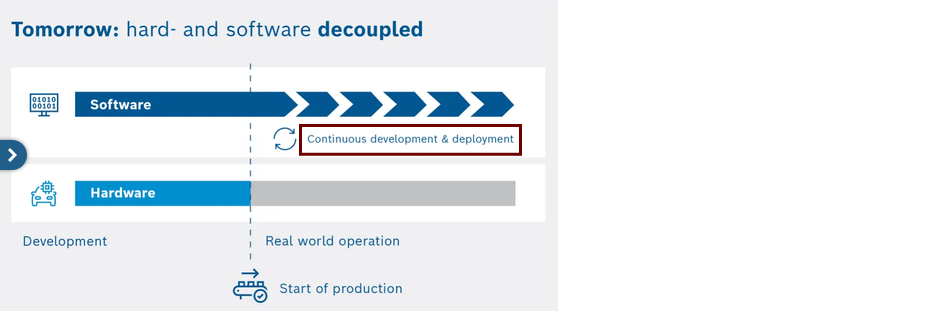
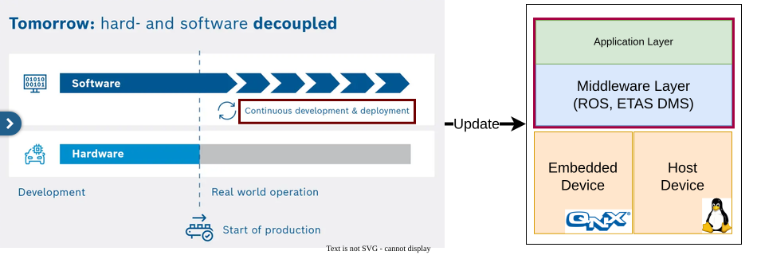

:PROPERTIES:
:ID:       vsm-en-from-cars-to-clinics
:END:
#+TITLE: Safe Engineering
#+SUBTITLE: From Cars to Clinics
#+AUTHOR: Dr. Fabian Franzelin
#+DATE: 2026-09-24
#+LANGUAGE: en
#+CATEGORY: Talk
#+OPTIONS: toc:nil num:nil timestamp:nil author:t tags:nil ^:{}
#+EXCLUDE_TAGS: noexport
#+REVEAL_ROOT: ../assets/vendor/reveal.js
#+CONFIDENCE: Public — CC0-1.0
#+REVEAL_REVEAL_JS_VERSION: 4
#+REVEAL_THEME: white
#+REVEAL_MARGIN: 0.02
#+REVEAL_CENTER: nil
#+REVEAL_INIT_OPTIONS: center: false, margin: 0.02, transition: 'slide', width: 1200, height: 760, hash: true, history: true, hashOneBasedIndex: true
#+REVEAL_PLUGINS: (highlight)
#+REVEAL_TITLE_SLIDE: <h2>%t</h2><h4>%s</h4>
%a · %d

Talk · W2-Professorship Computer Science · Reutlingen University

#+REVEAL_SLIDE_NUMBER: c/t
#+REVEAL_HLEVEL: 2
#+REVEAL_EXTERNAL_PLUGINS: (RevealPointer . "../assets/vendor/reveal.js-pointer/dist/pointer.js")
#+REVEAL_EXTRA_CSS: assets/vsm-theme.css
#+REVEAL_EXTRA_CSS: ../assets/vendor/reveal.js-pointer/dist/pointer.css
#+HTML_HEAD: <link href="../assets/vendor/fonts/fonts.css" rel="stylesheet">

* Automotive Safety

#+HTML: 

#+ATTR_HTML: :alt Vehicle, embedded device, and cloud device :style position:absolute; inset:0; width:100%; height:100%; object-fit:contain;

#+ATTR_HTML: :class fragment fade-in :data-fragment-index 1 :alt Sensor data flows from the vehicle to embedded and cloud devices :style position:absolute; inset:0; width:100%; height:100%; object-fit:contain;

#+HTML: 

#+HTML: 

#+begin_quote
All deployed software from Start of Production (SoP) must be safe.

Safety is the absence of unreasonable risk (ISO 26262).
#+end_quote
#+HTML: 

* The Setup

#+HTML: 

#+HTML: 

# -------------------------------------------------------------------
#+HTML: 

*The middleware*
- ~1M LOC in total
- Tooling (e.g., the digital twin core): ~560k LOC
- Includes the digital twin, which is safety-relevant
#+HTML: 

#+HTML: 

*Release Cadence*
- every three months
#+HTML: 

#+HTML: 

*Development*
- ~100 engineers, continuously
#+HTML: 

#+HTML: 

# -------------------------------------------------------------------
#+HTML: 

#+HTML: 

*Required artifacts*
- Complete specification and test coverage reports
- Architecture documentation
- Safety and security manual
- Tool development plan
- Engineering process
- etc.
#+HTML: 

#+ATTR_REVEAL: :frag (fade-in)
→ *certification* through independent party
#+HTML: 

# -------------------------------------------------------------------
#+HTML: 

* From Research to Transferable Product :ATTACH:
:PROPERTIES:
:ID:       662ea14c-fd4a-4920-837f-10b19baf798a
:END:
# -------------------------------------------------------------------
#+HTML: 

*Processes are important*
1. *Repeatable* outcomes across teams and releases
2. *Traceable* evidence for safety and certification
3. *Auditable* by independent parties
#+HTML: 

# -------------------------------------------------------------------
#+HTML: 

# -------------------------------------------------------------------
#+HTML: 

#+HTML: 

*Docs-as-Code*
1. Version control
2. Continuous integration
3. Code reviews
4. Plain text formats
#+ATTR_HTML: :alt Org mode logo :style position:absolute; top:0; right:3.5em; width:3em; max-height:3em; object-fit:contain;
[[attachment:Org-mode-unicorn.png]]
#+ATTR_HTML: :alt GitHub logo :style position:absolute; top:0; right:0; width:3em; max-height:3em; object-fit:contain;
[[attachment:github.png]]
#+HTML: 

#+HTML: 

# -------------------------------------------------------------------
#+HTML: 

*Safety is a mindset*
1. Everyone's concern
2. It affects every part of the product
#+ATTR_HTML: :alt ISO 26262 logo :style position:absolute; top:0; right:0; width:4em; max-height:4em; object-fit:contain;
[[attachment:iso-26262.png]]
#+HTML: 

#+HTML: 

# -------------------------------------------------------------------

* Conclusion - Cars to Clinics

#+HTML: 

#+HTML: 

*Shared safety principles*
- Defined processes
- Change management
- Configuration management
- Risk-based development
- Traceability
- Safety evidence
#+HTML: 

#+HTML: 

*Transferable practice*
- Processes (e.g., IEC 62304 ↔ ISO 26262 mapping)
- Tools (docs-as-code, CI, traceability)
- Digital twin concepts
#+HTML: 

#+HTML: 

* Colophon

#+begin_quote
The complete middleware is released and qualified according to ISO
26262 since May 2026.
#+end_quote

#+ATTR_REVEAL: :frag (fade-in)
- Slides in *Org*, diagrams via *PlantUML* and *draw.io*, rendered with
  *Reveal.js*, versioned on *GitHub*.
- A *demo application* of a medical device sends data to a dashboard
  alongside these slides.
- Everything runs in a *Docker* container.

* Repository & Questions

#+BEGIN_EXPORT html

<blockquote>These slides.  This demo.  Reproducible.  Public domain.</blockquote>

<code>github.com/fabianfranzelin/vernetzte-systeme-in-der-medizin</code>

Thank you --- questions?

Scan to open the repository

#+END_EXPORT
